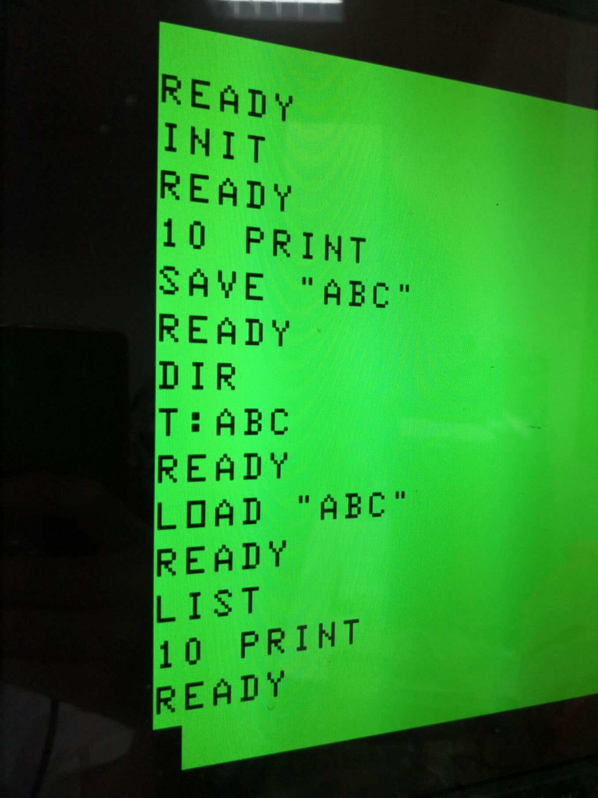
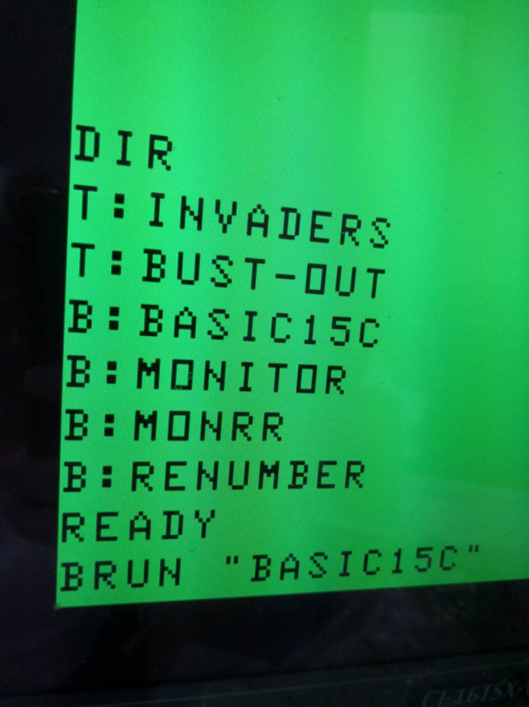
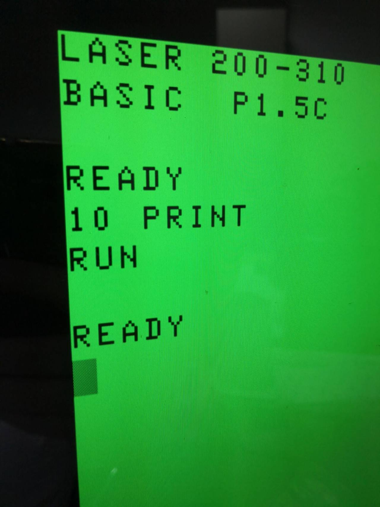

# LASER310 FPGA with FLOOPY DRIVE EMU

Welcome to LASER310_FPGA project. This project is an attempt to recreate the once famous VZ300/Laser310 computer in 80's on Altera Cyclone based FPGA boards.

Features implemented:
1. MC6847 /w VGA output
2. Super high resolution mode (256*192)
3. Cassette input/output emu
4. Laser310 internal ROM/DOS ROM on flash
5. Enable external ROM with onboard switches at runtime.
6. VZ200 support
7. 34KB + 8KB RAM
8. Buzzer output
9. PS/2 keyboard support (Ctrl+F12 to reset).
10. 12.5MHz overclock on SW0
11. Floppy emu support

***Screenshots***  
  
  

***Supported boards***

- Terasic DE1
- Terasic DE2

***Folder structures***

rom:

VZ300/Laser310 roms

Software:

development tools for this project. 

vz:

Some come games for testing.

SYSTEM-B.vz is a binary file loading/saving tool for cassette/disk on Laser 310.

BASIC_P1.5C.vz is an extended Basic for Laser 310 developed by XinMin Peng in 80's.

MONITORR.vz is a Laser 310 system monitor.

More details on these VZ300/Laser310 softwares to follow.

